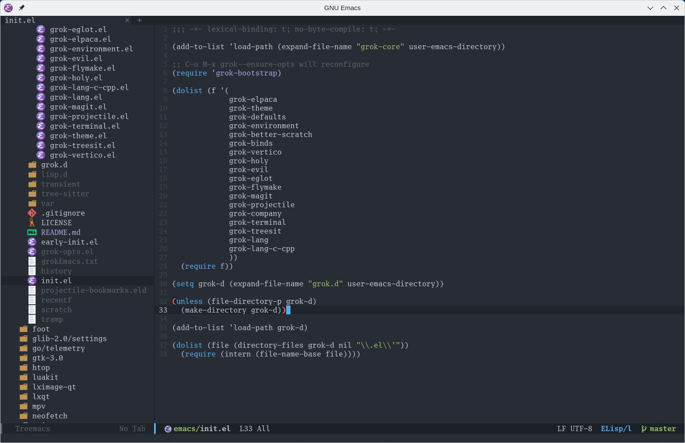
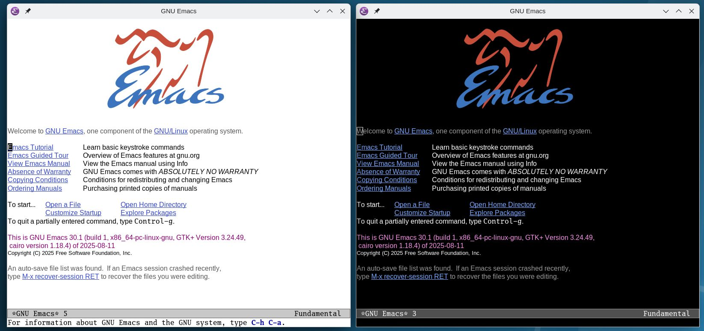

# grokEmacs

[how to grok Emacs](https://www.youtube.com/playlist?list=PLFf4Ibrb-mjTcoaVv6orVtH93K47GPrwl)

fork it - clone it - own it.

`git clone https://github.com/a-schaefers/grokEmacs.git ~/.config/emacs`

## Announcement

I've ditched the "framework caretaker" role.

This project does not use GitHub Issues. Instead, please submit your improvements via Pull Request.

grokEmacs is a new rewrite, different from Spartan Emacs, but it achieves many of the same goals in a better way. To find Spartan Emacs, see the [archived branch](https://github.com/a-schaefers/spartan-emacs/tree/spartan-emacs-archive).

## Interactive Initial Setup

On first launch, grokEmacs asks a few questions (projects dir, evil mode, theme (fancy/minimal), (light/dark) variants, font, font-size, line numbers, transparency etc.) and saves your answers to `~/.config/emacs/grok-opts.el`. You can re-run anytime with `C-u M-x grok--ensure-opts`. Options are just setqs, so you can edit them by hand too.

Fancy uses the doom-one theme variants, doom modeline, treemacs, and dashboard etc.

While minimal uses the built-in modus theme variants with an uncluttered modeline

## Project goals

- almost **no abstraction**
- **elpaca** package manager
- **use-package** ensure and demand everything up front (avoids bugs, reduces config complexity, and delivers a snappy Emacs by default)
- start in ~1s on an old PC
- **gccemacs** native compilation
- **eglot lsp + company** autocompletion
- **magit+projectile** for VC & project awareness
- **flymake** linting
- **treesitter** everywhere as much as possible
- **vertico** minibuffer fuzzy completion
- *[dape](https://github.com/svaante/dape) (debug adapter protocol support) is planned, coming soon*

> Be the best programmer's text editor in the world - using the most light-weight and best, hand-picked tools - ready to be forked, hacked on, and made one's own.

## Binds

### Holy Mode (Vanilla Emacs)

By default you get Emacs’ vanilla keybindings, which is already first-class, plus a couple helpers:

- **crux** — quality-of-life shortcuts (smarter line movement, duplicate, kill whole line, etc.).
- **paredit** — structural editing for Lisp code, keeps parens balanced.

### Evil Mode (Vim-style)

If you enabled Evil during setup, you also get Vim-style editing plus common addons:

- **evil** — core Vim emulation.
- **evil-collection** — makes Magit, dired, and many other modes feel Vim-like.
- **evil-commentary** — toggle comments with `gc`, like Vim’s commentary.
- **evil-surround** — change/add/delete surrounding quotes, parens, tags.
- **evil-matchit** — jump between matching pairs (if/else, HTML tags, etc.).
- **evil-cleverparens** — Lisp structural editing, Vim-style (similar to paredit).

### Treesit to the future

As treesit support improves, we probably will target [combobulate](https://github.com/mickeynp/combobulate) to get a sort-of of paredit-like
experience beyond scheme/lisp language families.

### Additional language-specific binds

Language modes may add their own bindings as needed. See `grok-core/grok-binds.el` for full details.

### General
- `M-x pro` → `projectile-commander`
- `M-x cc` → `compile`
- `M-x sh` → `shell` (a dumb shell buffer)
- `M-x eat` → `eat` (a fully-featured terminal, no vterm dep)
- `M-x git` → `magit`
- `M-x lint` → enable `flymake` + diagnostics buffer
- `C-c i` → open `init.el`
- `C-t` → open `treemacs` (if 'fancy')

### Eglot
- `M-m r` → rename symbol
- `M-m o` → organize imports
- `M-m h` → show doc (eldoc)
- `M-m =` → format buffer/region
- `M-m ?` → find references
- `M-.`   → jump to definition

### Eldoc-box
- `C-c C-h` → doc popup at point
- `K` (Evil normal mode only) → doc popup at point

## Assumptions

I do not care about Terminal Emacs. If a hardcore `emacs -nw` user wants to improve that experience, I will gladly merge a PR, provided it meets these conditions:

- All GUI-only assumptions must be guarded with (display-graphic-p) checks, and likewise for terminal-only code.
- Clipboard handling must work out of the box, as graphical Emacs already provides, with compatibility across Xorg, Wayland, and macOS.
- Themes must not look terrible in terminal mode - either by disabling global font-lock, or by using a minimal terminal-only theme that lets the terminal handle colors.

## License
[Public Domain (Unlicense)](https://unlicense.org)
