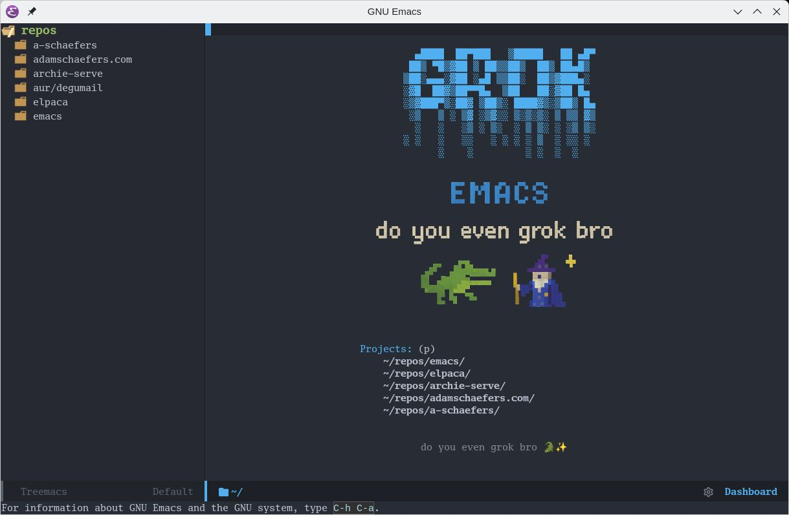
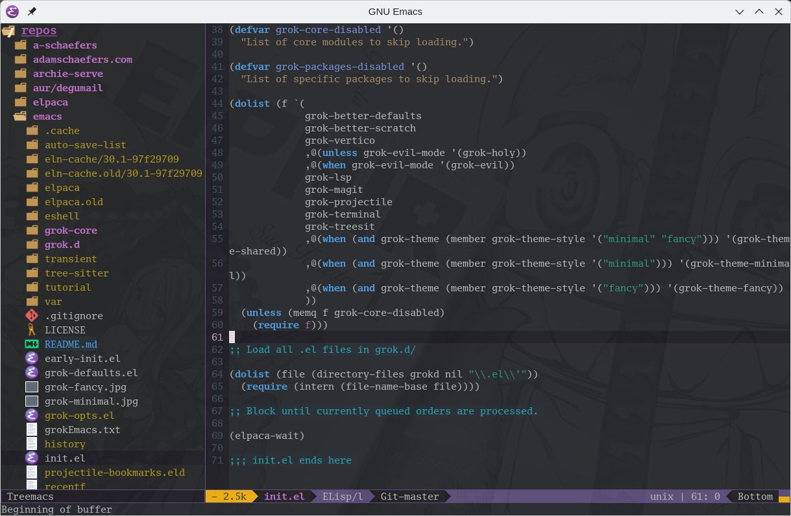
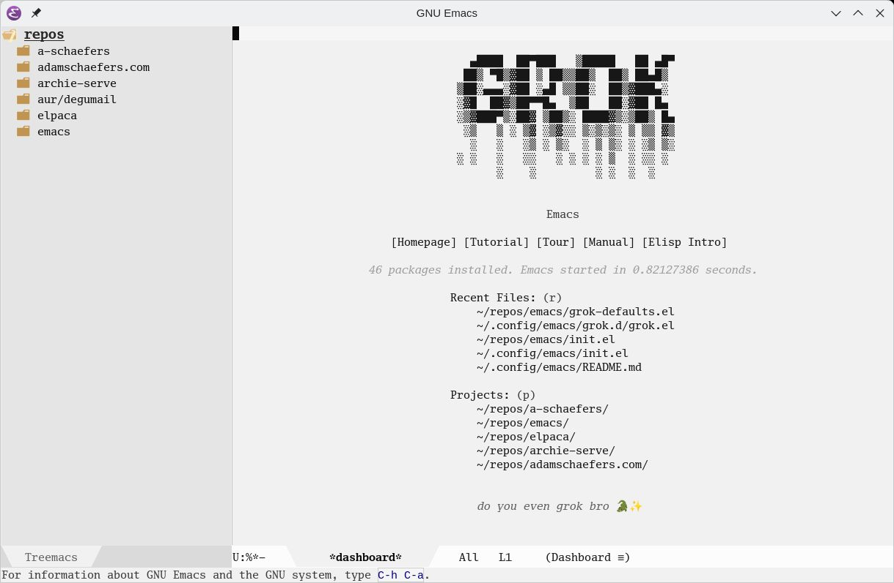
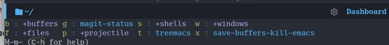

# grokEmacs


<sub><sup>Logo generated with ChatGPT (OpenAI)</sup></sub>

## Features

- **Setup wizard** to look-good out of the box
- **Optional evil-mode** and supportive packages, with Space bound as a discoverable leader key
- **Simple module system** that you can completely override
- **elpaca** package manager + **use-package**
- **gccemacs** native compilation
- **eglot lsp + company** autocompletion
- **magit+projectile** for VC & project awareness
- **flymake** linting (sideline, eldoc-box)
- **treesitter** everywhere as much as possible
- **vertico** fuzzy completion
- *[dape](https://github.com/svaante/dape) (debug adapter protocol support) is planned, coming soon*

## Quick Start

`git clone https://github.com/a-schaefers/grokEmacs.git ~/.config/emacs` and if you're new, maybe checkout my [how to grok Emacs](https://www.youtube.com/playlist?list=PLFf4Ibrb-mjTcoaVv6orVtH93K47GPrwl) series.

If you encounter an error in the bootstrap such as: `[2025-08-17 14:11:25] fatal: destination path '/home/$USER/.config/emacs/elpaca/repos/treemacs' already exists and is not an empty directory.` It probably is the result of a partial clone + network timeout, leaving repos/treemacs/ half-baked; the re-clone then balked because the dir existed. In this case the solution is `M-x elpaca-delete RET treemacs` and then restarting Emacs to finish the bootstrap process.

## Announcement

This project does not use GitHub Issues. Instead, please submit your improvements via Pull Request.

grokEmacs is a new rewrite, different from Spartan Emacs, but it achieves many of the same goals in a better way. To find Spartan Emacs, see the [archived branch](https://github.com/a-schaefers/spartan-emacs/tree/spartan-emacs-archive).

## ✨ Interactive Initial Setup Wizard 🧙

The very first time you launch **grokEmacs**, you’ll be greeted by a short wizard. Your answers are written to `~/.config/emacs/grok-opts.el`

> ⚡ Tip: If you want to hack things directly, just open `~/.config/emacs/grok-opts.el` after running the wizard. Or you can always restart the wizard with `C-u M-x grok--ensure-opts` if you change your mind about something.

### 🪄 What you’ll be asked

The prompts appear one by one in the minibuffer:

1. **📂 Projects Directory**
   > “Where do you keep your code?”
   Enter the folder path (default: `~/repos`). Projectile & Magit will look here.

2. **😈 Evil Mode or 😇 Holy Mode**
   > “Do you want Vim-style keys?”
   Choose Evil if you live in Vim-land, or stick with Emacs defaults.

3. **🧙 Theme Setup**
   > “Do you want to customize the look, or keep it vanilla?”
   - **Skip** → You get pure “angry fruit salad” Emacs defaults.
   - **Continue** → Pick *fancy* or *minimal* styling.

4. **🎨 Fancy vs Minimal**
   - **Fancy** → Install a theme package (default: `doom-themes`), pick a theme (default: `doom-one`), and choose a modeline style (`doom`, `spaceline`, `moody`, or none).
   - **Minimal** → Stick to built-in themes like `modus-operandi` or `modus-vivendi`. A clean modeline shows just the essentials (modified, file, line, mode).

5. **🪟 Transparency**
   > “Want to see through your editor?”
   Type a number `0–99` (lower = more see-through). Leave blank or `100` for solid.

6. **🔤 Font & 📏 Size**
   > “What font do you like? And how big should it be?”
   Defaults to *Source Code Pro* and *11* if you’re not picky.
   It will fallback to Monospace if the font is not found on your system.

7. **🔢 Line Numbers**
   > “Do you want line numbers?”
   If yes, you’ll also be asked whether you prefer absolute or relative.

### 🎩 Fancy Mode

With Fancy enabled, grokEmacs pulls in your chosen theme package, applies your selected theme, and wires up extras:
- Dashboard on startup
- Treemacs sidebar
- Custom modeline (Doom/Spaceline/Moody)
- Window auto-resizing + splash (disable with `(setq grok-window-pop-enabled nil)` and `(setq grok-window-pop-splash nil)`)

**The following examples are just what the wizard writes into grok-opts.el, you don't have to do it manually.**

doom-themes, doom-one, doom-modeline, splash:

```elisp
(setq grok-projects "~/repos/")
(setq grok-evil-mode nil)
(setq grok-theme t)
(setq grok-theme-style "fancy")
(setq grok-custom-theme-pkg 'doom-themes)
(setq grok-custom-theme 'doom-one)
(setq grok-use-modeline "doom")
(setq grok-alpha-background "100")
(setq grok-font "Go Mono")
(setq grok-font-size "11")
(setq grok-line-numbers t)
(setq grok-relative-line-numbers nil)
(setq grok-core-disabled '())
(setq grok-packages-disabled '())
(setq grok-window-pop-enabled t)
(setq grok-window-pop-splash t)
```



spacemacs-theme, spacemacs-dark, spaceline `grok-opts.el`:

```elisp
(setq grok-projects "~/repos/")
(setq grok-evil-mode nil)
(setq grok-theme t)
(setq grok-theme-style "fancy")
(setq grok-custom-theme-pkg 'spacemacs-theme)
(setq grok-custom-theme 'spacemacs-dark)
(setq grok-use-modeline "spaceline")
(setq grok-alpha-background "97")
(setq grok-font "Go Mono")
(setq grok-font-size "11")
(setq grok-line-numbers t)
(setq grok-relative-line-numbers nil)
(setq grok-core-disabled '())
(setq grok-packages-disabled '())
(setq grok-window-pop-enabled t)
(setq grok-window-pop-splash t)
```



tao-theme, tao-yang, moody `grok-opts.el`, no-splash:

```elisp
(setq grok-projects "~/repos/")
(setq grok-evil-mode nil)
(setq grok-theme t)
(setq grok-theme-style "fancy")
(setq grok-custom-theme-pkg 'tao-theme)
(setq grok-custom-theme 'tao-yang)
(setq grok-use-modeline "moody")
(setq grok-alpha-background "100")
(setq grok-font "Go Mono")
(setq grok-font-size "11")
(setq grok-line-numbers t)
(setq grok-relative-line-numbers nil)
(setq grok-core-disabled '())
(setq grok-packages-disabled '())
(setq grok-window-pop-enabled t)
(setq grok-window-pop-splash nil)
```



### 📦 Minimal Mode

Minimal mode skips the extra fancy bloat and gives you just enough polish. You’ll pick one of the built-in themes (recommended: `modus-operandi` or `modus-vivendi`), and get a lightweight modeline. If you want the vanilla modeline, though, just set `(setq grok-use-modeline "none")`.

```elisp
(setq grok-projects "~/repos/")
(setq grok-evil-mode nil)
(setq grok-theme t)
(setq grok-theme-style "minimal")
(setq grok-custom-theme-pkg nil)
(setq grok-use-modeline "minimal")
(setq grok-custom-built-in-theme 'modus-operandi)
(setq grok-alpha-background "")
(setq grok-font "Go Mono")
(setq grok-font-size "11")
(setq grok-line-numbers nil)
(setq grok-line-numbers nil)
(setq grok-relative-line-numbers nil)
;; additional settings
;; (setq grok-core-disabled '())
;; (setq grok-packages-disabled '())
```


#### Disable module files entirely

Suppose you looked through `init.el` and `grok-core/`, and decided you don’t want
`grok-better-defaults` or `grok-better-scratch` to load at all. Just add this to `grok-opts.el`:

```elisp
(setq grok-core-disabled '(grok-better-defaults grok-better-scratch))
```

#### Disable specific packages

Maybe you like most of `grok-core/grok-evil.el`, but you’d prefer to handle
`which-key` and `general.el` yourself. In that case, disable just those packages:

```elisp
(setq grok-packages-disabled '(which-key general))
```

#### Add your own overrides

Your **personal sandbox** is `grok.d/`.
By default, it contains a generated `grok.el` with sane defaults, loaded *last*.
That’s the best place to add hacks, keybinds, or tweaks.
You can also drop additional `.el` files into `grok.d/` - they’ll be picked up automatically.

## 📝 Local Customization (`grok.el`)

After the initial setup, grokEmacs creates a file called **`grok.el`** in your config directory.
This file is **yours to edit** - it’s `.gitignore`d so updates to grokEmacs won’t overwrite it.
If you delete it, a fresh copy will be regenerated on the next restart.

Whenever you pull new versions of grokEmacs, it’s recommended to compare your `grok.el` against
`grok-defaults.el` using the built-in diff helper:

```
C-c gu   (grok-update-config-with-ediff)
```

Run this after a `git pull` to ensure nothing important has changed or broken.

### 🔧 What `grok.el` does

- **ENV / PATH customization**
  Set environment variables (`EDITOR`, `VISUAL`, `PAGER`) and prepend/append to your `PATH`.
  This is just an alternative, Emacs-way to modify your environment and PATH instead of the typical `.bash_profile` or `.bashrc` type of stuff.

- **Language Servers (LSP / Eglot)**
  Defines `grok-eglot-autostart-langs`, a mapping of modes to language server binaries.
  When those binaries are found on your PATH, grokEmacs will auto-start Eglot for that language.
  Example: `python-ts-mode` → `pylsp`, `go-ts-mode` → `gopls`.

- **General Defaults**
  - Tabs disabled globally, fill-column set to 79 (Python style).
  - Default compile command: `make -k`.
  - Some optional global keybinds:
    - `C-h C-b` → Show Grok keybinds
    - `C-c gi` → Edit init.el
    - `C-c gg` → Edit grok.el
    - `C-c go` → Edit setup options (`grok-opts.el`)
    - `C-c gu` → Compare config with defaults (ediff)
  - Starts an Emacs server automatically.

- **Package Overrides**
  - `eglot` gets remapped keys on `M-m` (rename, imports, format, etc.).
  - `company` completion uses `C-n` / `C-p` for navigation.
  - Optional extras (like `vterm`) can be enabled by uncommenting.

- **Language-specific override examples**
  - `c-ts-mode` and `c++-ts-mode`: use Linux kernel tab/indent rules.
  - `makefile-mode`: Tabs enforced (since Makefiles require them).

### ✅ Best Practices

- Keep your personal tweaks here - grokEmacs core modules won’t touch this file.
- Use it for small overrides, keybinds, or enabling extra packages.
- For larger or experimental changes, consider using separate files under `grok.d/` and keeping them in version control. *(Note: only `grok.el` is gitignored by default — everything else in `grok.d/` is tracked if you want it to be.)*
- After updating grokEmacs (`git pull`), always run `C-c gu` to check for differences and avoid surprises.

## Keybinds



**Space** leader (evil) / **M-m** (holy) discoverable menu shown above.

### Holy Mode (Emacs style)

In **Holy mode** you keep Emacs’ world-class defaults, plus a few helpers and a leader system:

- **Emacs defaults** - all the standard `C-x ...` / `M-x ...` bindings.
- **M-m leader** - powered by `which-key` + `general.el`. Press **M-m** to explore menus.
- **Language extras** - when editing code, **M-m** includes `eglot` bindings.
- **crux** - smarter line movement, duplicate lines, kill whole line, etc.
- **paredit** - structural Lisp editing, keeps parentheses balanced.

### Evil Mode (Vim style)

If you enabled Evil during setup, you get Vim’s modal editing plus a leader system:

- **Evil defaults** - normal/insert/visual modes and Vim-style motions.
- **SPACE leader** - powered by `which-key` + `general.el`. Press **Space** to explore menus.
- **Language extras** - when editing code, **M-m** is available for `eglot` bindings.
- **evil-collection** - makes Magit, Dired, and other modes feel natural in Vim.
- **evil-commentary** - toggle comments with `gc`.
- **evil-surround** - add/change/delete surrounding quotes, parens, tags.
- **evil-matchit** - jump between matching pairs (if/else, HTML tags, etc.).
- **evil-cleverparens** - Lisp structural editing, Vim-style (like paredit).

### Treesit to the future

As treesit support improves, we probably will target [combobulate](https://github.com/mickeynp/combobulate) to get a sort-of of paredit-like
experience beyond scheme/lisp language families.

### Additional language-specific binds

Language modes may add their own bindings as needed.

## Assumptions

### emacs versions

- Expects Emacs 30+ --with-native-compilation --with-tree-sitter ...

### terminal

This configuration is optimized for GUI Emacs. If a hardcore `emacs -nw` user wants to improve that experience, I will gladly merge a PR, provided it meets these conditions:

- All GUI-only assumptions must be guarded with (display-graphic-p) checks, and likewise for terminal-only code.
- Clipboard handling must work out of the box, as graphical Emacs already provides, with compatibility across Xorg, Wayland, and macOS.
- Themes must not look terrible in terminal mode - either by disabling global font-lock, or by using a minimal terminal-only theme that lets the terminal handle colors.

## License
[Public Domain (Unlicense)](https://unlicense.org)
