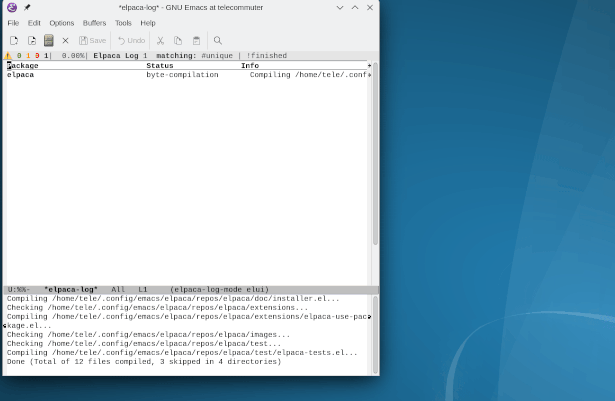

# grokEmacs

## Quick Start

```sh
git clone https://github.com/a-schaefers/grokEmacs.git ~/.config/emacs
```



## Announcement

This project does not use GitHub Issues. Instead, please submit your improvements via Pull Request.

grokEmacs is a new rewrite, different from Spartan Emacs, but it achieves many of the same goals in a better way. To find Spartan Emacs, see the [archived branch](https://github.com/a-schaefers/spartan-emacs/tree/spartan-emacs-archive).

## Features

- Setup wizard for themes, fonts, and evil/holy mode
- Optional **Evil mode** with leader key (Space), or Emacs defaults with **M-m**
- **elpaca** + **use-package** for packages
- **Eglot** for LSP, **vertico/corfu/orderless** for completion
- **Magit/projectile**, **flymake**, **treesitter**
- Native compilation
- *[dape](https://github.com/svaante/dape) (debug adapter protocol support) is planned, coming soon*

## Customization

> When asked “🧙 Continue to theme customization wizard?”, choosing Skip leaves you with bare vanilla Emacs appearance and no polish. If you continue, the next prompt “🎨 Theme style (✨ fancy | 📦 minimal)” lets you pick: Minimal, which applies a built-in theme and simple modeline for a clean setup, or Fancy, which installs an external theme (of your choice), custom modelines, dashboard, and Treemacs. Both "minimal" and "fancy" offer followup questions to obtain your preferences regarding fonts, line numbering, transparency, etc.

- Initial Setup Wizard writes answers to `~/.config/emacs/grok-opts.el`. For more info, see `C-h v` on the setup variables in `grok-opts.el`.
- Optionally disable modules/packages in grok-opts.el with `grok-core-disabled` or `grok-packages-disabled`.
- Primary and final configuration live in `grok.d/grok.el` (gitignored).
- Optionally add new `.el` files in `grok.d/` to extend further (tracked).

## Keybinds

- **Holy Mode**: Emacs defaults + `M-m` leader (which-key menu, eglot, paredit, crux).
- **Evil Mode**: Vim modal editing + Space leader (which-key menu, evil-collection, commentary, surround, cleverparens). Eglot still lives on M-m unless customized in `grok.el`.

## Requirements

- Emacs 30+ with native compilation and tree-sitter.
- GUI recommended; terminal support welcome via PRs.

## License

[Unlicense](https://unlicense.org)
